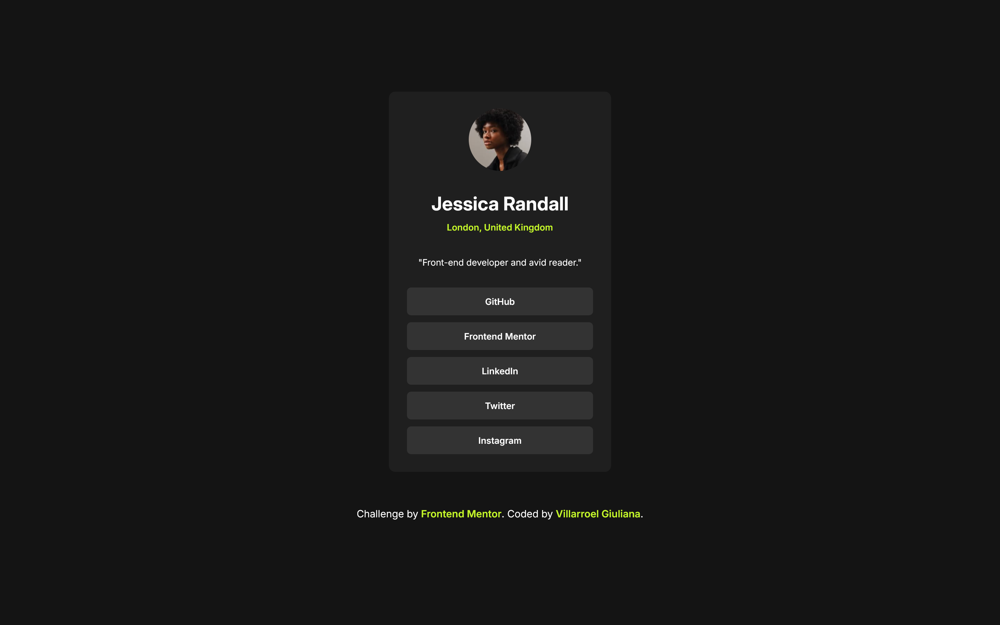

# Social Links Profile | Frontend Mentor

This is a solution to the [QR code component challenge on Frontend Mentor](https://www.frontendmentor.io/learning-paths/getting-started-on-frontend-mentor-XJhRWRREZd/steps/68a5211a186ba06a54bb02f4/challenge/start). Frontend Mentor challenges help you improve your coding skills by building realistic projects. 

## Table of Contents

- [Overview](#overview)
  - [What I learned](#what-i-learned)
- [Built with](#built-with)
- [Features](#features)
- [Acknowledgements](#acknowledgements)
- [Author](#author)

## Overview

I built a social links profile card that serves as a centralized hub for sharing all social media profiles in one place. The project features a clean profile layout with an avatar, personal information, and a collection of styled social media buttons that users can customize with their own links.

### What I learned

- **Mobile-First CSS Architecture**: Building from the smallest screen size up taught me to write more efficient CSS and avoid unnecessary media query overrides.
- **Adaptive Typography Systems**: Implementing fluid typography that scales naturally across devices using CSS clamp() for optimal readability.
- **CSS Custom Properties for Theming**: Using CSS variables to create a maintainable color system that could easily be personalized or themed.

## Built with

- HTML5 Semantic Structure
- CSS3 Mobile-First Design
- CSS Custom Properties (Variables)
- Adaptive Typography (clamp, rem, em)
- CSS Flexbox Layouts
- Responsive Design Principles

## Features

- **Mobile-First Responsive Design**: Built starting from mobile breakpoints and progressively enhanced for tablet and desktop experiences.
- **Adaptive Typography System**: Typography that scales fluidly across all screen sizes using modern CSS techniques like clamp() and relative units.
- **Complete Responsiveness**: Layout adapts seamlessly from 375px mobile devices to large desktop screens without breaking or compromising usability.
- **Clean CSS Architecture**: Well-organized stylesheet using CSS custom properties and mobile-first methodology for maintainable code.

This small but powerful [Frontend Mentor](https://www.frontendmentor.io/challenges) project reinforced essential CSS skills and responsive design patterns that are fundamental to modern web development.

## Acknowledgements

- [Frontend Mentor](https://www.frontendmentor.io/challenges) for creating practical projects that build real-world frontend skills
- The design community for inspiring clean, user-focused interface patterns

## Author

- Website [social links profile](#)
- GitHub [@gvillarroel-dev](https://github.com/gvillarroel-dev)